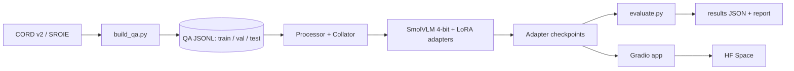

# Architecture

## 1. System overview

Five stages, each independently runnable: **data -> train -> evaluate -> analyze -> serve**.

## 2. Components

| Component | Path | Responsibility |
|-----------|------|----------------|
| Data builder | `src/receiptqa/data/` | Download, convert annotations to QA pairs, split by receipt |
| Dataset + collator | `src/receiptqa/data/` | Apply chat template, tokenize, mask non-answer tokens |
| Model loader | `src/receiptqa/models/` | Load 4-bit base, attach LoRA, load saved adapters |
| Trainer | `src/receiptqa/train/` | Config-driven training loop, logging, checkpointing |
| Evaluator | `src/receiptqa/eval/` | Generate answers, compute metrics, bootstrap CI, error dumps |
| Inference | `src/receiptqa/inference/` | Single-image prediction used by the app and eval |
| Demo | `app/` | Gradio UI with base vs fine-tuned comparison |

## 3. Model

- **Base:** SmolVLM-500M-Instruct (primary), SmolVLM-256M-Instruct (fast debugging).
- **Architecture (high level):** vision encoder -> connector that compresses image tokens -> small language model decoder. Images become visual tokens fed into the LM alongside text.
- **Quantization (QLoRA):** base weights frozen in 4-bit NF4, double quantization on, bf16 compute dtype.
- **Adapters:** LoRA on the language model's attention and MLP projections.

| Setting | Final value |
|---------|-------------|
| LoRA rank `r` | 16 |
| `lora_alpha` | 32 |
| dropout | 0.05 |
| target modules | `q_proj, k_proj, v_proj, o_proj, gate_proj, up_proj, down_proj` (LM only) |
| Vision encoder | frozen |
| Connector | frozen |

At 256M, full fine-tuning may fit in 8GB, so the 256M model was used for fast pipeline debugging. QLoRA is the primary method reported for the 500M model.

## 4. Training design

- **Input format:** chat template with image + question as the user turn, answer as the assistant turn.
- **Loss masking:** labels are `-100` everywhere except answer tokens and the end-of-turn token. Prompt and image tokens do not contribute to loss.
- **Padding:** right-pad for training, left-pad for generation.
- **Memory levers:** per-device batch size 2, gradient accumulation 8, gradient checkpointing, paged 8-bit AdamW, capped image resolution, and 4-bit base weights.
- **Final training configuration:** 2 epochs, learning rate `2e-4`, cosine schedule, seed 42, image longest edge 1536 with image splitting enabled.

## 5. Image resolution

Receipts have small dense text. Low resolution can hurt legibility, while high resolution increases visual-token count and memory.

Token-count analysis recorded approximately:

- **1536 longest edge:** 484 visual tokens per receipt
- **2048 longest edge:** 881 visual tokens per receipt

The main run used **1536 with image splitting enabled**. This configuration achieved **84.4% final test EM** with **3.22 GB peak training VRAM**.

A 2048-resolution ablation remains future work; the final test results do not establish that it would improve performance.

## 6. Memory budget

| Item | Planning note | Measured / recorded result |
|------|---------------|----------------------------|
| 4-bit base weights | Quantized and frozen | Not separately instrumented |
| LoRA params + grads + optimizer | Small relative to activations | Not separately instrumented |
| Activations | Dominant memory component; depends on image/token count | Not separately instrumented |
| Peak training VRAM | Target < 7.5 GB within an 8GB GPU | **3.22 GB** |

Peak VRAM was measured during the successful `20261002-500m-r16-e2` training run.

## 7. Inference and comparison

One model load serves both outputs. The fine-tuned answer runs with the adapter enabled, while the base answer runs with the adapter disabled. This supports a fair base-vs-adapter comparison without loading two complete base models.

Final adapter latency on the evaluation run was approximately **0.41 s/question p50** and **1.05 s/question p95**, with batching used for benchmarking.

## 8. Evaluation pipeline

`evaluate.py` loads the selected split, generates answers greedily (`do_sample=False`, short `max_new_tokens`), normalizes strings, computes Exact Match, ANLS, numeric accuracy, per-type metrics, and bootstrap confidence intervals, and writes results under `outputs/results/`.

The final test set was evaluated once after model selection.

## 9. Configuration and reproducibility

- One YAML per experiment in `configs/`. The exact configuration is copied into the run output.
- Seeds are set for Python, NumPy, and PyTorch.
- Dependency versions are recorded in `requirements.txt` / `pyproject.toml`.
- Run ids use `YYYYMMDD-<model>-<short-desc>`.
- The final model run is `20261002-500m-r16-e2`.
- The repository test suite currently passes **31/31 tests**.

## 10. Deployment

- **Adapter only** is intended for Hugging Face Hub distribution; the base model is loaded separately.
- The Gradio app supports base vs fine-tuned comparison.
- A hosted Space should be treated as a separate deployment step. GPU availability and runtime depend on the hosting tier, so the local app should be verified first.
- A recorded demo GIF is a fallback if hosted inference is unavailable or too slow.

## 11. Failure modes

| Failure | Evidence / cause | Guard |
|---------|------------------|-------|
| Model answers with a template phrase instead of reading | Template overfitting is possible with generated questions | Multiple paraphrases + held-out phrasing evaluation |
| Wrong digits in totals | Difficult receipt text can still be misread | Resolution study + numeric-accuracy metric |
| Loss looks good but generalization is weak | Training/validation mismatch or leakage | Split by receipt + validation + held-out phrasing |
| Garbage generation after training | Padding/template mismatch | Same chat template in train and inference |
| Host-RAM DataLoader crash | Multiple workers increased preprocessing memory pressure on Windows | Final run uses `num_workers: 0` |
| Item lists are incomplete or contain unrelated text | Final test error analysis identified `wrong_items`, missing/extra items, and copied-line failures | Report per-type performance and failure analysis; item-list remains a known limitation |
