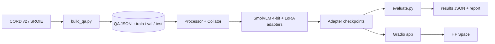

# Architecture

## 1. System overview

Five stages, each independently runnable: **data -> train -> evaluate -> analyze -> serve**.

## 2. Components

| Component | Path | Responsibility |
|-----------|------|----------------|
| Data builder | `src/receiptqa/data/` | Download, convert annotations to QA pairs, split by receipt |
| Dataset + collator | `src/receiptqa/data/` | Apply chat template, tokenize, mask non-answer tokens |
| Model loader | `src/receiptqa/models/` | Load 4-bit base, attach LoRA, load saved adapters |
| Trainer | `src/receiptqa/train/` | Config-driven training loop, logging, checkpointing |
| Evaluator | `src/receiptqa/eval/` | Generate answers, compute metrics, bootstrap CI, error dumps |
| Inference | `src/receiptqa/inference/` | Single-image prediction used by the app and eval |
| Demo | `app/` | Gradio UI with base vs fine-tuned comparison |

## 3. Model

- **Base:** SmolVLM-500M-Instruct (primary), SmolVLM-256M-Instruct (fast debugging). Verify exact HF repo ids at setup.
- **Architecture (high level):** vision encoder -> connector that compresses image tokens -> small language model decoder. Images become a fixed number of visual tokens fed into the LM alongside text.
- **Quantization (QLoRA):** base weights frozen in 4-bit NF4, double quantization on, bf16 compute dtype.
- **Adapters:** LoRA on the language model's attention and MLP projections.

| Setting | Starting value |
|---------|----------------|
| LoRA rank `r` | 16 |
| `lora_alpha` | 32 |
| dropout | 0.05 |
| target modules | `q_proj, k_proj, v_proj, o_proj, gate_proj, up_proj, down_proj` (LM only) |
| Vision encoder | frozen |
| Connector | frozen (ablation: trainable) |

Note: at 256M, full fine-tuning may fit in 8GB anyway. QLoRA is the primary path on 500M and the point of the project.

## 4. Training design

- **Input format:** chat template with image + question as the user turn, answer as the assistant turn.
- **Loss masking:** labels are `-100` everywhere except answer tokens (and the end-of-turn token). Prompt and image tokens never contribute to loss.
- **Padding:** right-pad for training, left-pad for generation.
- **Memory levers:** batch size 1-2 + gradient accumulation, gradient checkpointing, paged 8-bit AdamW, capped max sequence length, capped image resolution.

## 5. Image resolution (key design knob)

Receipts have small dense text. Low resolution destroys legibility, high resolution explodes visual token count and VRAM. Plan:
1. Print the token count per image at each resolution setting (Week 1).
2. Compare image splitting on/off and longest-edge sizes on a small subset.
3. Pick the best setting that fits in 8GB and record it in `DECISIONS.md`.

## 6. Memory budget (fill from real measurements)

| Item | Estimate | Measured |
|------|----------|----------|
| 4-bit base weights | < 1 GB | TBD |
| LoRA params + grads + optimizer | < 0.5 GB | TBD |
| Activations (with checkpointing) | dominant, depends on resolution | TBD |
| Peak VRAM at chosen config | target < 7.5 GB | TBD |

## 7. Inference and comparison

One model load serves both outputs. The fine-tuned answer runs with the adapter enabled, the base answer runs inside `with model.disable_adapter():`. This halves VRAM in the demo and guarantees a fair comparison.

## 8. Evaluation pipeline

`evaluate.py` loads the test JSONL, generates answers greedily (`do_sample=False`, `max_new_tokens` small), normalizes strings, computes metrics, and writes `outputs/results/<run_id>.json`. See `EVALUATION.md`.

## 9. Configuration and reproducibility

- One YAML per experiment in `configs/`. The exact config is copied into the run's output directory.
- Seeds set for Python, NumPy, and PyTorch. Dataloader workers seeded.
- Dependency versions pinned in `requirements.txt` / `pyproject.toml`.
- Run ids: `YYYYMMDD-<model>-<short-desc>` (e.g. `20260105-500m-r16-res1024`).

## 10. Deployment

- **Adapter only** is pushed to the HF Hub (small, a few tens of MB), base model is pulled from its own repo.
- HF Space runs the Gradio app. If the free CPU tier is too slow for 500M, options are: 256M adapter, ZeroGPU, or a recorded demo.

## 11. Failure modes

| Failure | Cause | Guard |
|---------|-------|-------|
| Model answers with a template phrase instead of reading | Overfit to question templates | Paraphrase set, held-out templates |
| Wrong digits in totals | Low resolution / tokenization of numbers | Higher resolution, numeric-accuracy metric |
| Loss looks great, test is bad | Leakage between splits | Split by receipt, test in `tests/` |
| Garbage generation after training | Wrong padding side or template mismatch | Same chat template in train and inference |
